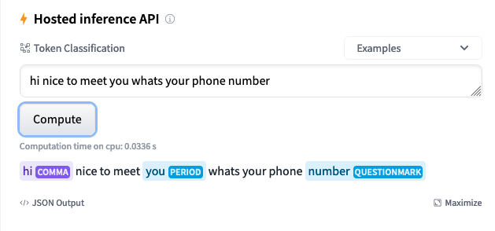
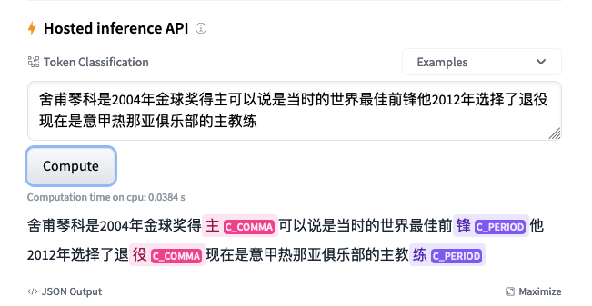

# Distilbert-punctuator

<p align="center">
  <a href="https://pypi.org/project/distilbert-punctuator/">
      
  </a>
  <a href="https://pepy.tech/project/distilbert-punctuator">
      
  </a>
  <a href="https://tldrlegal.com/license/apache-license-2.0-(apache-2.0)">
      
  </a>
</p>

## Introduction
Distilbert-punctuator is a python package provides a bert-based punctuator (fine-tuned model of `pretrained huggingface DistilBertForTokenClassification`) with following three components:

* **data process**: funcs for processing user's data to prepare for training. If user perfer to fine-tune the model with his/her own data.
* **training**: training pipeline and doing validation. User can fine-tune his/her own punctuator with the pipeline
* **inference**: easy-to-use interface for user to use trained punctuator.
* If user doesn't want to train a punctuator himself/herself, two pre-fined-tuned model from huggingface model hub
  * `Qishuai/distilbert_punctuator_en` 📎 [Model details](https://huggingface.co/Qishuai/distilbert_punctuator_en)
  * `Qishuai/distilbert_punctuator_zh` 📎 [Model details](https://huggingface.co/Qishuai/distilbert_punctuator_zh)
* model examples in huggingface web page.
  * English model
  <figure>
    
  </figure>

  * Simplified Chinese model
  <figure>
    
  </figure>

## Installation
* Installing the package from pypi: `pip install distilbert-punctuator` for directly usage of punctuator.
* Installing the package with option to do data processing `pip install distilbert-punctuator[data_process]`.
* Installing the package with option to train and validate your own model `pip install distilbert-punctuator[training]`
* For development and contribution
  * clone the repo
  * `make install`

## Data Process
Component for pre-processing the training data. To use this component, please install as `pip install distilbert-punctuator[data_process]`

The package is providing a simple pipeline for you to generate `NER` format training data.

### Example
`examples/data_sample.py`

## Train
Component for providing a training pipeline for fine-tuning a pretrained `DistilBertForTokenClassification` model from `huggingface`.
The latest version has the implementation of **`R-Drop`** enhanced training. 
[R-Drop github repo](https://github.com/dropreg/R-Drop)
[Paper of R-Drop](https://arxiv.org/abs/2106.14448)

### Example
`examples/english_train_sample.py`

### Training_arguments:
Arguments required for the training pipeline.

- # basic arguments
  - `training_corpus(List[List[str]])`: list of sequences for training, longest sequence should be no longer than pretrained LM # noqa: E501
  - `validation_corpus(List[List[str]])`: list of sequences for validation, longest sequence should be no longer than pretrained LM # noqa: E501
  - `training_tags(List[List[int]])`: tags(int) for training
  - `validation_tags(List[List[int]])`: tags(int) for validation
  - `model_name_or_path(str)`: name or path of pre-trained model
  - `tokenizer_name(str)`: name of pretrained tokenizer

- # training arguments
  - `epoch(int)`: number of epoch
  - `batch_size(int)`: batch size
  - `model_storage_dir(str)`: fine-tuned model storage path
  - `label2id(Dict)`: the tags label and id mapping
  - `early_stop_count(int)`: after how many epochs to early stop training if valid loss not become smaller. default 3 # noqa: E501
  - `gpu_device(int)`: specific gpu card index, default is the CUDA_VISIBLE_DEVICES from environ
  - `warm_up_steps(int)`: warm up steps.
  - `r_drop(bool)`: whether to train with r-drop
  - `r_alpha(int)`: alpha value for kl divengence in the loss, default is 0
  - `plot_steps(int)`: record training status to tensorboard among how many steps
  - `tensorboard_log_dir(Optional[str])`: the tensorboard logs output directory, default is "runs"

- # model arguments
  - `addtional_model_config(Optional[Dict])`: additional configuration for model

You can also train your own NER models with the trainer provided in this repo. 
The example can be found in `notebooks/R-drop NER.ipynb`

## Evaluation
Validation of fine-tuned model

### Example
`examples/train_sample.py`

### Validation_arguments:
- `evaluation_corpus(List[List[str]])`: list of sequences for evaluation, longest sequence should be no longer than pretrained LM's max_position_embedding(512)
- `evaluation_tags(List[List[int]])`: tags(int) for evaluation (the GT)
- `model_name_or_path(str)`: name or path of fine-tuned model
- `tokenizer_name(str)`: name of tokenizer
- `batch_size(int)`: batch size
- `label2id(Optional[Dict])`: label2id. Default one is from model config. Pass in this argument if your model doesn't have a label2id inside config
- `gpu_device(int)`: specific gpu card index, default is the CUDA_VISIBLE_DEVICES from environ

## Inference
Component for providing an inference interface for user to use punctuator.

### Architecture
```
 +----------------------+              (child process)
 |   user application   |             +-------------------+
 +                      + <---------->| punctuator server |
 |   +inference object  |             +-------------------+
 +----------------------+
```

The punctuator will be deployed in a child process which communicates with main process through pipe connection.
Therefore user can initialize an inference object and call its `punctuation` function when needed. The punctuator will never block the main process unless doing punctuation.
There is a `graceful shutdown` methodology for the punctuator, hence user dosen't need to worry about the shutting-down.

### Example
`examples/inference_sample.py`

### Inference_arguments
Arguments required for the inference pipeline.

- `model_name_or_path(str)`: name or path of pre-trained model
- `tokenizer_name(str)`: name of pretrained tokenizer
- `tag2punctuator(Dict[str, tuple])`: tag to punctuator mapping.
   dbpunctuator.utils provides two default mappings for English and Chinese
   ```python
   NORMAL_TOKEN_TAG = "O"
   DEFAULT_ENGLISH_TAG_PUNCTUATOR_MAP = {
       NORMAL_TOKEN_TAG: ("", False),
       "COMMA": (",", False),
       "PERIOD": (".", True),
       "QUESTIONMARK": ("?", True),
       "EXLAMATIONMARK": ("!", True),
   }

   DEFAULT_CHINESE_TAG_PUNCTUATOR_MAP = {
       NORMAL_TOKEN_TAG: ("", False),
       "C_COMMA": ("，", False),
       "C_PERIOD": ("。", True),
       "C_QUESTIONMARK": ("? ", True),
       "C_EXLAMATIONMARK": ("! ", True),
       "C_DUNHAO": ("、", False),
   }
   ```
   for own fine-tuned model with different tags, pass in your own mapping
- `tag2id_storage_path(Optional[str])`: tag2id storage path. Default one is from model config. Pass in this argument if your model doesn't have a tag2id inside config
